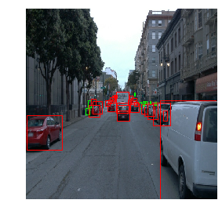
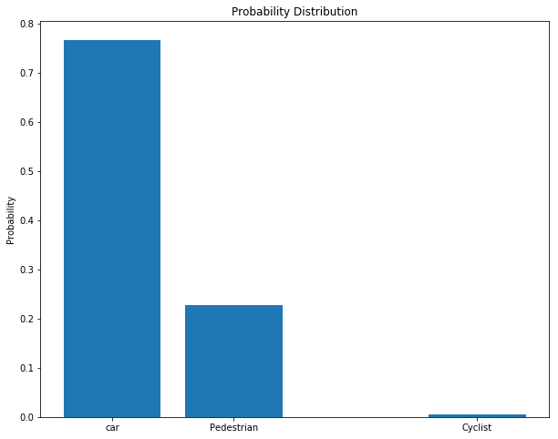
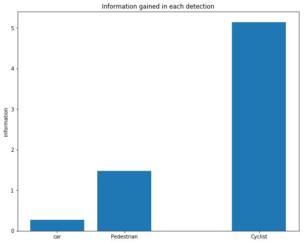
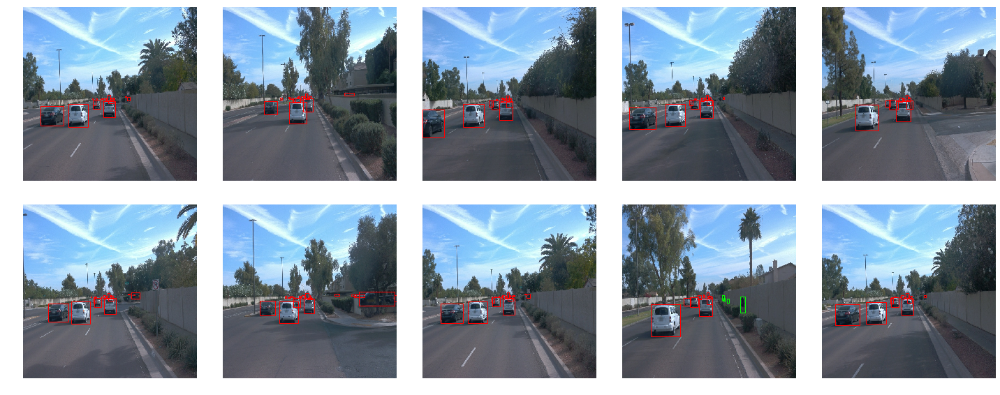
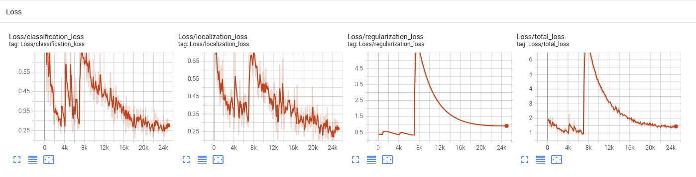
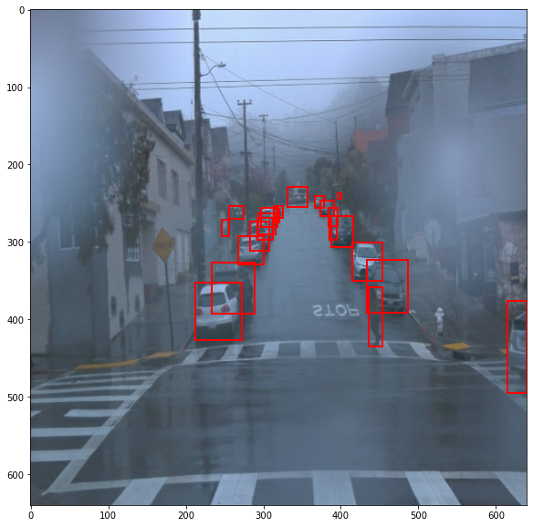
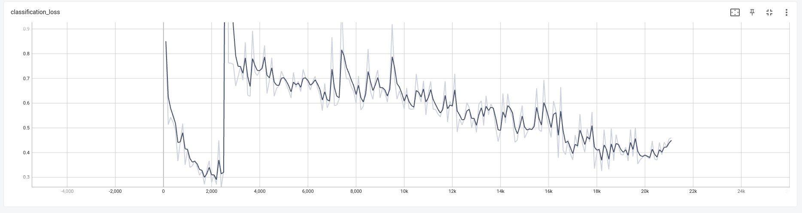
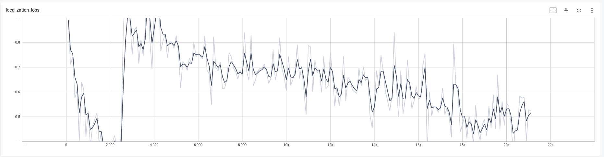
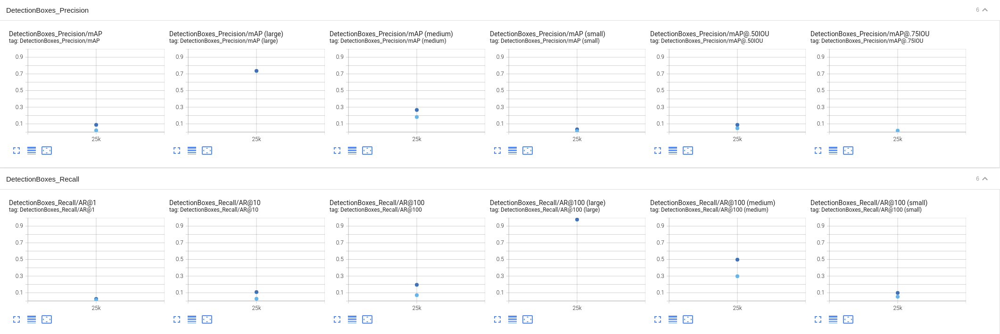
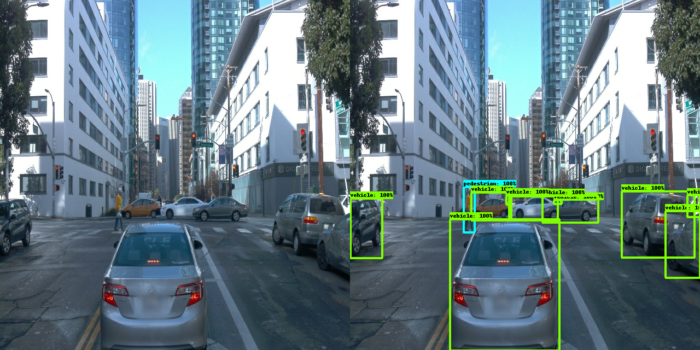

# Object detection in an Urban Environment


### Project overview
This section should contain a brief description of the project and what we are trying to achieve. Why is object detection such an important component of self driving car systems?

In this project we will detect actors in traffic scenarios such as vehicles, pedestrian, and cyclists from images. This perception phase is very crucial for the whole self driving car system as every planning and control system depends on accurate perception results. Thus we have to use one of the best object detection models such as faster-rcnn or SSD. With the [tensorflow object detection api](https://github.com/tensorflow/models/tree/master/research/object_detection) we can use these famous models train them for our purpose with ease.

I've used SSD, [Single Shot MultiBox detector](https://arxiv.org/pdf/1512.02325.pdf) for this project as it can run in realtime with 59 FPS and outperforms faster-rcnn in VOC2007 test. By training and evaluating with and without data augmentation I've shown the effect of data augmentation on training the model. It seems that simple data augmentation technique such as random horizontal flip and brightness change can prevent the model from overfitting and acheive better result in unseen data.

### Set up
* The github repository for this project is [here](https://github.com/HyungunKim/nd013-c1-vision-starter.git) and you can clone it with the following code.This will create `nd013-c1-vision-starter` folder in your current directory.
```
git clone https://github.com/HyungunKim/nd013-c1-vision-starter.git
```

* Next, it is recommended to use docker image for this project. Here is the [installation guide](https://docs.docker.com/engine/install/ubuntu/) for the docker. Also please refer to [this guide](https://docs.nvidia.com/datacenter/cloud-native/container-toolkit/install-guide.html) to use gpu support for the docker.

* If you have docker installed the image for this project is [here](https://hub.docker.com/repository/docker/dkrhkkim/ndsdc). You can get and run the image with the code below. Just run it in `nd013-c1-vision-starter` directory.

```
sudo docker run --gpus all -v `pwd`:/app/project/ -ti --rm -p 8888:8888 dkrhkkim/ndsdc:new bash
```


* The Open Waymo Dataset is large and is not included in the image. It should be created in `nd013-c1-vision-starter/data/waymo/processed`. You can download in your workspace with 
```
mkdir -p ./data/waymo/
python download_process.py --data_dir ./data/waymo/
```

* With `create_splits.py` the train, valid, and test sets are created with 70%, 10%, 20% of the total. Just run the code below if you've finished `download_process.py` and you're all set.
```
python create_splits.py --data_dir ./data/waymo/processed/
```

### Dataset
#### Dataset description

The images in the processed data is rgb image with uint8 data, i.e. pixel values range from 0~255. Each object in an image is labeled with class id 1, 2, or 4 and their bounding box coordinates. The class id 1 means vehicle, 2 means pedestiran, and 4 means cyclist. The bounding boxes are represented with two relative coordinates (x1, y1) and (x2, y2) of top-left corner and bottom-right corner of the box. Below is example of dataset images and their corresponding bounding boxes. 



#### Data distribution
There are lot of objects in the whole datasets but they dont appear in similar frequencies. I've sampled 100 images from total 100 files and counted their appearances. The probability of appearance were very unbalanced as you can see from the bar graph below. The probability an object is a vehicle is nearly 77%, while the probability of the object is a cyclist is less than 1%.




The information of a probabilistic event is defined as negative log of the probability. Below is the bar of information gained from object being a specific class. As you can see detecting a cyclist has 20 times more information from detecting a vehicle.



#### Cross validation
The images from the same files have similar scenaries as shown in images below.



To include different scenes during training, I've shuffled total 100 files and split them into 70 training files, 10 validation files, and 20 test files. This process is done with `create_splits.py` code.

In `Exploratory Data Analysis.ipynb`'s Image section, you can see a sample image for the whole 100 files.

### Training 
The training is done from base SSD model with different preprocessing steps. One with data augmentation and one without data augmentation which is the reference experiment to test the effect of data augmentation. The total training step takes more than 20k+ steps to see the full picture of the training.
#### Reference experiment
The Reference experiment of training the SSD model is done without data augmentation. The classification and localization loss dropped about to 0.25, 0.25 respectively during training. But there was a significant amount of bumps in losses in 2k mark, as shown in figures below. The validation score was 0.02 mAP which is very low!




#### Data Augmentation experiment
The data augmentation methods I've tried was random horizontal flip, brightness, contrast, hue, and saturation adjustments. I've created a copy of pipieline_new.config and added the following codes in train_config
```
  data_augmentation_options {
    normalize_image {
      original_minval: 0.0
      original_maxval: 255.0
      target_minval: 0.0
      target_maxval: 1.0
    }

    random_horizontal_flip {
      probability: 0.5
    }

    random_adjust_brightness {
      max_delta: 0.2
    }

    random_adjust_contrast {
      min_delta: 0.8
      max_delta: 1.25
    }

    random_adjust_hue {
      max_delta: 0.02
    }

    random_adjust_saturation{
      min_delta: 0.8
      max_delta: 1.25
    }
  }
```
As the above code implies, some of the training datas will be flipped horizontally as in the image below. (The stop sign is clearly flipped horizontally)



Unfortunately this augmentation alone was not enough to detect smaller objects, But was able to reduce some overfitting issues. The training loss was both a bit higher for classification and localization, But the overall mAP was about 4 times higher. As in the figure below, the mAP metric for Large objects was near 0.8 which isn't very bad, but for medium and small objects the scores dropped significantly.






### Conclusion
The tensorflow object detection api is very powerful tool to test different object detection model and test preprocessing steps. In this project I've used Waymo open dataset to test SSD model to find actors in traffic scenaries. Data augmentation was straightforward and easy to implement in object detection api, and it helped to reduce overfitting in the trainning process. Unfortunately it had difficulties detecting small objects, but was farely good at detecting large objects as shown in the prediction result below.

